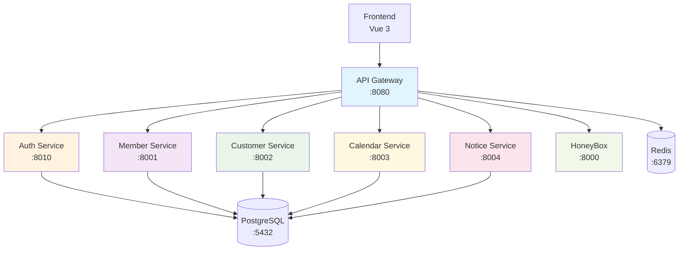

# 🚀 TS Portal API Gateway

> **마이크로서비스 아키텍처를 위한 중앙 집중식 API Gateway**

[](https://python.org)
[](https://fastapi.tiangolo.com)
[](https://github.com/astral-sh/uv)
[](https://docker.com)

## 📋 목차

- [🎯 개요](#-개요)
- [🏗️ 아키텍처](#️-아키텍처)
- [✨ 주요 기능](#-주요-기능)
- [🚀 빠른 시작](#-빠른-시작)
- [⚙️ 설정](#️-설정)
- [🔐 인증 시스템](#-인증-시스템)
- [🛣️ 라우팅 규칙](#️-라우팅-규칙)
- [📊 모니터링](#-모니터링)
- [🔧 개발](#-개발)
- [🚢 배포](#-배포)
- [📚 API 문서](#-api-문서)
- [🐛 트러블슈팅](#-트러블슈팅)

## 🎯 개요

TS Portal API Gateway는 **FastAPI 기반의 고성능 마이크로서비스 게이트웨이**입니다. 
5개의 마이크로서비스(Auth, Member, Customer, Calendar, Notice)와 HoneyBox를 통합하여 
**단일 진입점**을 제공합니다.

### 🌟 핵심 가치

- **🔐 보안 강화**: JWT 기반 통합 인증
- **🚀 고성능**: UV 기반 초고속 Python 환경
- **📊 가시성**: 실시간 모니터링 및 로깅
- **🛡️ 안정성**: Circuit Breaker 및 Rate Limiting
- **🔄 확장성**: 마이크로서비스 자동 발견

## 🏗️ 아키텍처



### 🔄 요청 흐름

1. **클라이언트 요청** → API Gateway (:8080)
2. **JWT 토큰 검증** → Auth Middleware
3. **사용자 정보 헤더 주입** → X-User-* Headers
4. **서비스 라우팅** → 해당 마이크로서비스
5. **응답 통합** → 클라이언트로 반환

## ✨ 주요 기능

### 🔐 인증 & 보안
- **JWT 토큰 검증**: 모든 요청에 대한 자동 인증
- **사용자 정보 주입**: 헤더를 통한 사용자 컨텍스트 전달
- **Role-based Access Control**: 역할 기반 접근 제어
- **CORS 설정**: Cross-Origin 요청 보안 관리

### 🛣️ 라우팅 & 프록시
- **동적 라우팅**: 경로 기반 자동 서비스 선택
- **로드 밸런싱**: 서비스 인스턴스 간 부하 분산
- **Circuit Breaker**: 장애 서비스 자동 차단
- **Retry Logic**: 실패 시 자동 재시도

### 📊 모니터링 & 로깅
- **실시간 헬스체크**: 모든 서비스 상태 모니터링
- **Prometheus 메트릭**: 성능 지표 수집
- **구조화된 로깅**: JSON 형태의 상세 로그
- **요청 추적**: 분산 트레이싱 지원

### 🛡️ 보안 & 성능
- **Rate Limiting**: API 호출 제한
- **Request Validation**: 입력 데이터 검증
- **Response Caching**: Redis 기반 캐싱
- **Timeout 관리**: 요청별 타임아웃 설정

## 🚀 빠른 시작

### 📋 사전 요구사항

- **Python 3.11+**
- **UV** (Python 패키지 관리자)
- **Docker & Docker Compose**
- **PostgreSQL** (마이크로서비스용)
- **Redis** (캐싱 및 Rate Limiting)

### 🏃‍♂️ 로컬 개발 환경

```bash
# 1. 프로젝트 클론
git clone <repository-url>
cd ts-portal/services/api-gateway

# 2. UV로 의존성 설치 (초고속!)
uv sync

# 3. 환경 변수 설정
cp .env.example .env
# .env 파일 편집

# 4. 개발 서버 실행
uv run uvicorn app.main:app --reload --host 0.0.0.0 --port 8080

# 5. API 문서 확인
open http://localhost:8080/docs
```

### 🐳 Docker 환경

```bash
# 1. Docker 이미지 빌드
docker build -t ts-portal-api-gateway .

# 2. 컨테이너 실행
docker run -p 8080:8080 \
  -e JWT_SECRET_KEY=your-secret-key \
  -e REDIS_HOST=redis \
  ts-portal-api-gateway

# 3. Docker Compose로 전체 시스템 실행
cd ../../
docker-compose up -d
```

## ⚙️ 설정

### 🔧 환경 변수

```bash
# 기본 설정
APP_NAME=TS Portal API Gateway
VERSION=1.0.0
DEBUG=false
HOST=0.0.0.0
PORT=8080

# JWT 인증
JWT_SECRET_KEY=your-super-secret-jwt-key-change-in-production
JWT_ALGORITHM=HS256
JWT_EXPIRE_MINUTES=1440

# Redis (캐싱 & Rate Limiting)
REDIS_HOST=redis
REDIS_PORT=6379
REDIS_DB=0
REDIS_PASSWORD=

# 마이크로서비스 엔드포인트
AUTH_SERVICE_URL=http://auth-service:8010
MEMBER_SERVICE_URL=http://member-service:8001
CUSTOMER_SERVICE_URL=http://customer-service:8002
CALENDAR_SERVICE_URL=http://calendar-service:8003
NOTICE_SERVICE_URL=http://notice-service:8004
HONEYBOX_SERVICE_URL=http://honeybox:8000

# 헬스체크
HEALTH_CHECK_INTERVAL=30
HEALTH_CHECK_TIMEOUT=5

# Rate Limiting
RATE_LIMIT_REQUESTS=100
RATE_LIMIT_WINDOW=60

# 타임아웃
REQUEST_TIMEOUT=30
CONNECTION_TIMEOUT=10
```

### 📝 설정 파일 구조

```
app/
├── core/
│   ├── config.py          # 환경 변수 및 설정 관리
│   ├── health.py          # 헬스체크 로직
│   └── metrics.py         # Prometheus 메트릭
├── middleware/
│   ├── auth.py            # JWT 인증 미들웨어
│   ├── logging.py         # 요청/응답 로깅
│   └── rate_limit.py      # Rate Limiting
├── routes/
│   ├── auth.py            # Auth Service 프록시
│   ├── members.py         # Member Service 프록시
│   ├── customers.py       # Customer Service 프록시
│   ├── calendar.py        # Calendar Service 프록시
│   ├── notices.py         # Notice Service 프록시
│   └── feeds.py           # HoneyBox 프록시
└── services/
    ├── service_registry.py # 서비스 발견 및 등록
    └── proxy.py           # HTTP 프록시 유틸리티
```

## 🔐 인증 시스템

### 🎫 JWT 토큰 처리

API Gateway는 모든 요청에 대해 JWT 토큰을 검증하고 사용자 정보를 헤더에 주입합니다.

```python
# 인증 흐름
1. 클라이언트 → Authorization: Bearer <token>
2. AuthMiddleware → JWT 토큰 검증
3. 사용자 정보 추출 → 헤더 주입
4. 마이크로서비스 → X-User-* 헤더 수신
```

### 📤 주입되는 헤더

```http
X-User-ID: 12345
X-Username: seungdobae
X-User-Role: admin
X-User-Permissions: read,write,admin
```

### 🚫 인증 제외 경로

```python
SKIP_AUTH_PATHS = {
    "/",                    # 루트
    "/docs",               # API 문서
    "/redoc",              # ReDoc 문서
    "/openapi.json",       # OpenAPI 스키마
    "/health",             # 헬스체크
    "/metrics",            # 메트릭
    "/api/auth/login",     # 로그인
    "/api/auth/refresh",   # 토큰 갱신
}
```

## 🛣️ 라우팅 규칙

### 📍 API 엔드포인트 매핑

| 경로 | 대상 서비스 | 포트 | 설명 |
|------|-------------|------|------|
| `/api/auth/*` | Auth Service | 8010 | 인증/권한 관리 |
| `/api/members/*` | Member Service | 8001 | 팀원 관리 |
| `/api/customers/*` | Customer Service | 8002 | 고객사 관리 |
| `/api/calendar/*` | Calendar Service | 8003 | 일정 관리 |
| `/api/notices/*` | Notice Service | 8004 | 공지사항 |
| `/api/feeds/*` | HoneyBox | 8000 | AWS 소식 |

### 🔄 프록시 로직

```python
# 요청 전달 과정
async def proxy_request(request: Request, service_url: str):
    # 1. 요청 헤더 정리 (Host 제거 등)
    # 2. 요청 본문 및 쿼리 파라미터 전달
    # 3. 타임아웃 설정으로 요청 전송
    # 4. 응답 헤더 정리 후 반환
    # 5. 에러 처리 및 로깅
```

## 📊 모니터링

### 🏥 헬스체크

```bash
# 통합 헬스체크
GET /health

# 응답 예시
{
  "status": "healthy",
  "gateway": "TS Portal API Gateway",
  "timestamp": "2025-01-01T00:00:00Z",
  "services": {
    "auth": {"status": "healthy", "response_time": "15ms"},
    "member": {"status": "healthy", "response_time": "12ms"},
    "customer": {"status": "healthy", "response_time": "18ms"},
    "calendar": {"status": "healthy", "response_time": "14ms"},
    "notice": {"status": "healthy", "response_time": "16ms"},
    "honeybox": {"status": "healthy", "response_time": "20ms"}
  }
}
```

### 📈 Prometheus 메트릭

```bash
# 메트릭 엔드포인트
GET /metrics

# 주요 메트릭
- http_requests_total: 총 요청 수
- http_request_duration_seconds: 요청 처리 시간
- http_requests_in_progress: 진행 중인 요청 수
- service_health_status: 서비스 상태
- rate_limit_exceeded_total: Rate Limit 초과 횟수
```

### 📝 로깅 형식

```json
{
  "timestamp": "2025-01-01T00:00:00Z",
  "level": "INFO",
  "service": "api-gateway",
  "request_id": "req-12345",
  "method": "GET",
  "path": "/api/members",
  "user_id": "12345",
  "username": "seungdobae",
  "response_time": "150ms",
  "status_code": 200,
  "target_service": "member-service"
}
```

## 🔧 개발

### 🛠️ 개발 환경 설정

```bash
# 1. 개발 의존성 설치
uv sync --dev

# 2. 개발 서버 실행 (핫 리로드)
uv run uvicorn app.main:app --reload --port 8080

# 3. 테스트 실행
uv run pytest

# 4. 코드 커버리지
uv run pytest --cov=app

# 5. 린팅 및 포맷팅
uv run black app/
uv run isort app/
uv run flake8 app/
```

### 🧪 테스트

```bash
# 전체 테스트 실행
uv run pytest -v

# 특정 테스트 파일
uv run pytest tests/test_auth.py -v

# 커버리지 리포트
uv run pytest --cov=app --cov-report=html
open htmlcov/index.html
```

### 📦 새로운 서비스 추가

1. **라우터 생성**
```python
# app/routes/new_service.py
from fastapi import APIRouter
router = APIRouter()

@router.api_route("/{path:path}", methods=["GET", "POST", "PUT", "DELETE"])
async def proxy_to_new_service(request: Request, path: str):
    # 프록시 로직 구현
    pass
```

2. **설정 업데이트**
```python
# app/core/config.py
SERVICES = {
    # ... 기존 서비스들
    "new_service": "http://new-service:8005"
}
```

3. **라우터 등록**
```python
# app/main.py
from app.routes import new_service

app.include_router(
    new_service.router, 
    prefix="/api/new-service", 
    tags=["🆕 New Service"]
)
```

## 🚢 배포

### 🐳 Docker 빌드

```bash
# 1. 이미지 빌드
docker build -t ts-portal-api-gateway:latest .

# 2. 멀티 아키텍처 빌드 (ARM64 + AMD64)
docker buildx build --platform linux/amd64,linux/arm64 \
  -t ts-portal-api-gateway:latest .

# 3. 이미지 푸시
docker push ts-portal-api-gateway:latest
```

### ☁️ AWS ECS 배포

```json
{
  "family": "ts-portal-api-gateway",
  "taskRoleArn": "arn:aws:iam::account:role/ecsTaskRole",
  "executionRoleArn": "arn:aws:iam::account:role/ecsTaskExecutionRole",
  "networkMode": "awsvpc",
  "requiresCompatibilities": ["FARGATE"],
  "cpu": "512",
  "memory": "1024",
  "containerDefinitions": [
    {
      "name": "api-gateway",
      "image": "ts-portal-api-gateway:latest",
      "portMappings": [
        {
          "containerPort": 8080,
          "protocol": "tcp"
        }
      ],
      "environment": [
        {
          "name": "ENVIRONMENT",
          "value": "production"
        }
      ],
      "logConfiguration": {
        "logDriver": "awslogs",
        "options": {
          "awslogs-group": "/ecs/ts-portal-api-gateway",
          "awslogs-region": "ap-northeast-2",
          "awslogs-stream-prefix": "ecs"
        }
      }
    }
  ]
}
```

### ⚓ Kubernetes 배포

```yaml
apiVersion: apps/v1
kind: Deployment
metadata:
  name: ts-portal-api-gateway
spec:
  replicas: 3
  selector:
    matchLabels:
      app: ts-portal-api-gateway
  template:
    metadata:
      labels:
        app: ts-portal-api-gateway
    spec:
      containers:
      - name: api-gateway
        image: ts-portal-api-gateway:latest
        ports:
        - containerPort: 8080
        env:
        - name: ENVIRONMENT
          value: "production"
        - name: JWT_SECRET_KEY
          valueFrom:
            secretKeyRef:
              name: ts-portal-secrets
              key: jwt-secret
        livenessProbe:
          httpGet:
            path: /health
            port: 8080
          initialDelaySeconds: 30
          periodSeconds: 10
        readinessProbe:
          httpGet:
            path: /health
            port: 8080
          initialDelaySeconds: 5
          periodSeconds: 5
---
apiVersion: v1
kind: Service
metadata:
  name: ts-portal-api-gateway-service
spec:
  selector:
    app: ts-portal-api-gateway
  ports:
  - port: 80
    targetPort: 8080
  type: LoadBalancer
```

## 📚 API 문서

### 📖 자동 생성 문서

- **Swagger UI**: http://localhost:8080/docs
- **ReDoc**: http://localhost:8080/redoc
- **OpenAPI JSON**: http://localhost:8080/openapi.json

### 📋 주요 엔드포인트

#### 🏠 기본 엔드포인트

```http
GET /                    # 루트 정보
GET /health             # 헬스체크
GET /metrics            # Prometheus 메트릭
```

#### 🔐 인증 관련

```http
POST /api/auth/login    # 로그인
POST /api/auth/logout   # 로그아웃
POST /api/auth/refresh  # 토큰 갱신
GET  /api/auth/me       # 사용자 정보
```

#### 👥 팀원 관리

```http
GET    /api/members              # 팀원 목록
POST   /api/members              # 팀원 생성
GET    /api/members/{id}         # 팀원 상세
PUT    /api/members/{id}         # 팀원 수정
DELETE /api/members/{id}         # 팀원 삭제
```

#### 🏢 고객사 관리

```http
GET    /api/customers            # 고객사 목록
POST   /api/customers            # 고객사 생성
GET    /api/customers/{id}       # 고객사 상세
PUT    /api/customers/{id}       # 고객사 수정
DELETE /api/customers/{id}       # 고객사 삭제
```

#### 📅 일정 관리

```http
GET    /api/calendar/events      # 일정 목록
POST   /api/calendar/events      # 일정 생성
GET    /api/calendar/events/{id} # 일정 상세
PUT    /api/calendar/events/{id} # 일정 수정
DELETE /api/calendar/events/{id} # 일정 삭제
```

#### 📢 공지사항

```http
GET    /api/notices              # 공지 목록
POST   /api/notices              # 공지 생성
GET    /api/notices/{id}         # 공지 상세
PUT    /api/notices/{id}         # 공지 수정
DELETE /api/notices/{id}         # 공지 삭제
```

#### 📰 AWS 소식

```http
GET /api/feeds                   # AWS 소식 목록
GET /api/feeds/latest            # 최신 소식
```

## 🐛 트러블슈팅

### 🔍 일반적인 문제들

#### 1. 서비스 연결 실패

**증상**: `503 Service Unavailable`

**해결책**:
```bash
# 서비스 상태 확인
curl http://localhost:8080/health

# 개별 서비스 확인
curl http://localhost:8001/health  # Member Service
curl http://localhost:8002/health  # Customer Service
# ... 다른 서비스들

# Docker 컨테이너 상태 확인
docker-compose ps
```

#### 2. JWT 토큰 인증 실패

**증상**: `401 Unauthorized`

**해결책**:
```bash
# JWT 시크릿 키 확인
echo $JWT_SECRET_KEY

# 토큰 디코딩 (jwt.io 사용)
# 토큰 만료 시간 확인

# Auth Service 로그 확인
docker logs ts-portal-auth-service
```

#### 3. Rate Limiting 초과

**증상**: `429 Too Many Requests`

**해결책**:
```bash
# Redis 연결 확인
redis-cli ping

# Rate Limit 설정 확인
echo $RATE_LIMIT_REQUESTS
echo $RATE_LIMIT_WINDOW

# Redis 키 확인
redis-cli keys "rate_limit:*"
```

#### 4. 메모리 부족

**증상**: 컨테이너 재시작, 느린 응답

**해결책**:
```bash
# 메모리 사용량 확인
docker stats

# 프로파일링 활성화
PYTHONPROFILE=1 uv run uvicorn app.main:app

# 메모리 최적화 설정
UVICORN_WORKERS=1  # 워커 수 줄이기
```

### 📊 로그 분석

```bash
# 실시간 로그 확인
docker logs -f ts-portal-api-gateway

# 에러 로그만 필터링
docker logs ts-portal-api-gateway 2>&1 | grep ERROR

# 특정 사용자 요청 추적
docker logs ts-portal-api-gateway 2>&1 | grep "user_id:12345"

# 응답 시간 분석
docker logs ts-portal-api-gateway 2>&1 | grep "response_time" | tail -100
```

### 🔧 성능 튜닝

```bash
# Uvicorn 워커 수 조정
uvicorn app.main:app --workers 4

# 비동기 처리 최적화
HTTPX_TIMEOUT=10
HTTPX_POOL_CONNECTIONS=100
HTTPX_POOL_MAXSIZE=20

# Redis 연결 풀 설정
REDIS_MAX_CONNECTIONS=20
REDIS_RETRY_ON_TIMEOUT=true
```

---

## 🤝 기여하기

1. **Fork** 프로젝트
2. **Feature 브랜치** 생성 (`git checkout -b feature/amazing-feature`)
3. **변경사항 커밋** (`git commit -m 'Add amazing feature'`)
4. **브랜치에 Push** (`git push origin feature/amazing-feature`)
5. **Pull Request** 생성

## 📄 라이선스

이 프로젝트는 MIT 라이선스 하에 있습니다. 자세한 내용은 [LICENSE](LICENSE) 파일을 참조하세요.

## 👨‍💻 개발자

**Seungdo Bae** - *Lead Developer*
- 📧 Email: seungdobae@saltware.co.kr
- 🐱 GitHub: [@seungdobae](https://github.com/seungdobae)

---

<div align="center">
  <p>Made with ❤️ by TS Team Seungdo Bae</p>
  <p>© 2025 Saltware CSG. All rights reserved.</p>
</div> 